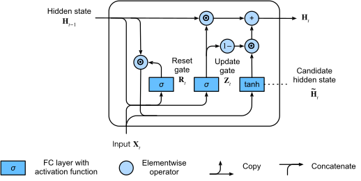

```
ssh -X <username>@ssh.ccv.brown.edu
cd ~/brainstorm-ws
git clone git@github.com:Brainstorm-Program/rnn-tutorial.git
```

# Brainstorm workshop series
## A tutorial on Recurrent Neural Networks (RNNs)

Our goal for this tutorial is to provide you with enough context and supporting code scaffold so that you are able to understand and implement basic RNN architectures. For the purposes of demonstration, we stick to the Gated Recurrent Unit (GRU) here. As always, Google is your friend. We too have relied on several sources for inspiration including D2L.ai (https://d2l.ai/chapter_recurrent-modern), the official PyTorch tutorials (https://pytorch.org/tutorials), and several open-sourced repositories.

### Let's get started
At this point you have encountered the GRU architecure (also pictured below from d2l.ai)



Our first goal is to implement the GRU architecture from scratch. You can find the model definition in ```models.py```. As for the dataset to train the model on, we have included a Fitzhugh-Nagumo synthetic data simulator. RNNs are particularly helpful for timeseries modeling since they are by-design equipped to track local and long range temporal dependencies. The FitzHugh-Nagumo model (http://www.scholarpedia.org/article/FitzHugh-Nagumo_model) is something that you encounter often in computational neuroscience as a simpler alternative to the Hodgkin-Huxley model.

\end{align*}&space;)

### Training our first GRU
To initiate the training process you can essentially run ```python gru_regression_scratch.py```. If you have the `train_visualization` flag set to `True`, you should observe something like this!


The same script also has code that performs an evaluation of this model on a completely new, randomly generated test set.

### Application: Autoregression
Can RNNs be trained as generative models? The short answer is yes! For more details refer to ```gru_autoregression.py```. We have included a trained model checkpoint, since this might take a bit longer to train!


### Using the GRU for timeseries classification
To demonstrate the versatality of RNNs, let's now use them on a classification problem. We have written a ```FitzhughNagumoClassification``` data loader for you to play with. Essentially, the idea is to sample activity traces from two different dynamical systems (let's call them Class A and Class B), and see if we can learn to classify them appropriately. To initiate the training process you can run ```python gru_classification_scratch.py```.

<p float="left">
  
   
</p>
